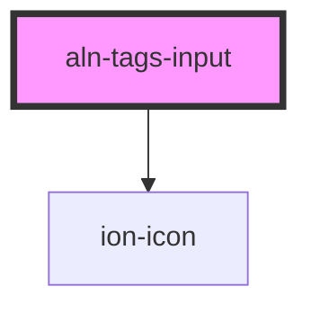

# aln-tags-input

<!-- Auto Generated Below -->

## Properties

| Property    | Attribute    | Description | Type       | Default |
| ----------- | ------------ | ----------- | ---------- | ------- |
| `tags`      | --           |             | `string[]` | `[]`    |
| `tagsBelow` | `tags-below` |             | `boolean`  | `false` |

## Dependencies

### Depends on

- ion-icon

### Graph

----------------------------------------------

*Built with [StencilJS](https://stenciljs.com/)*
